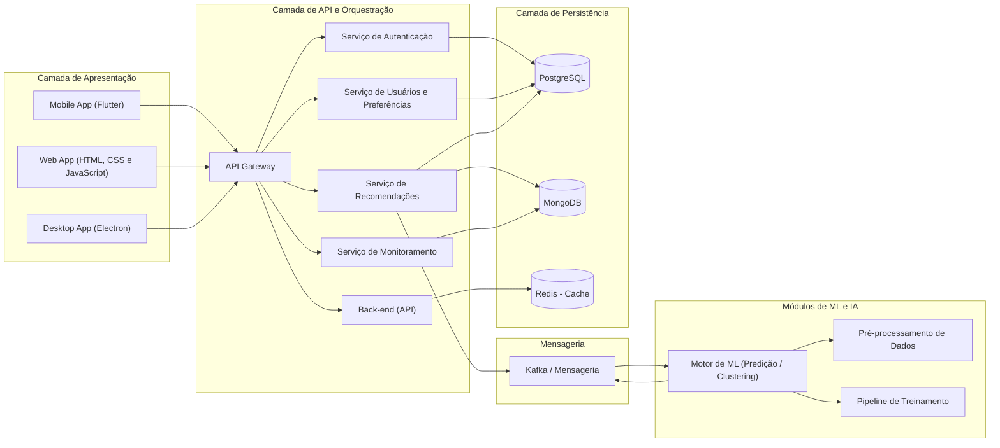
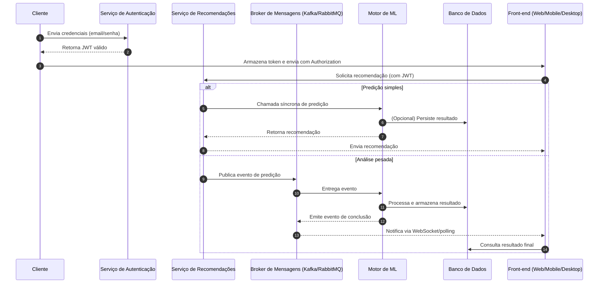
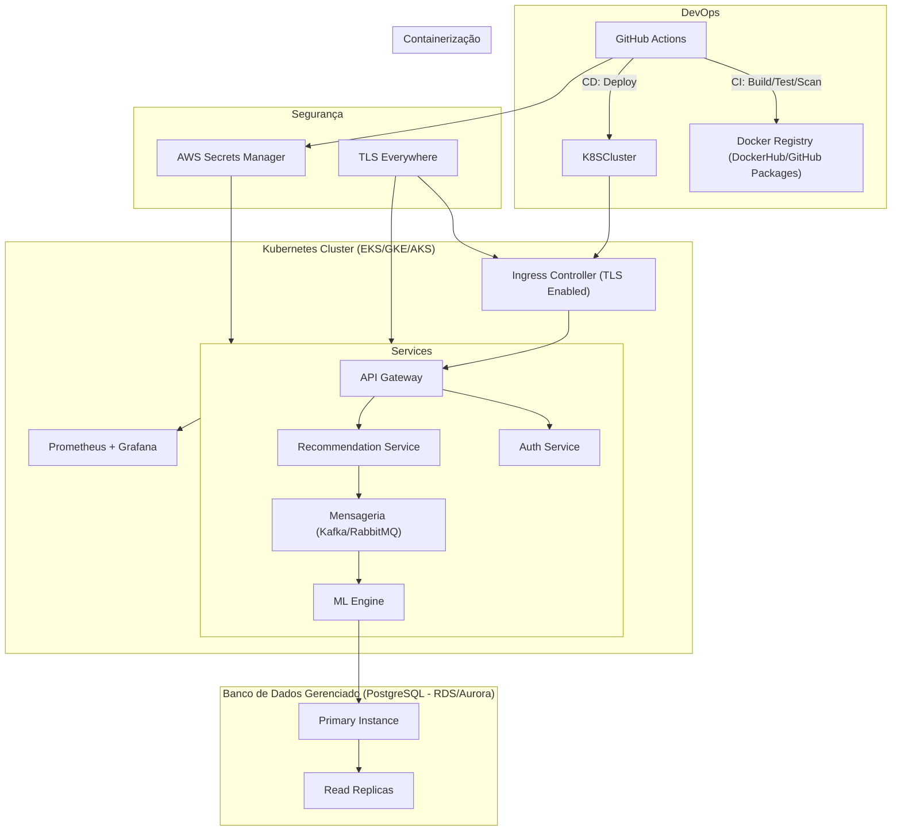
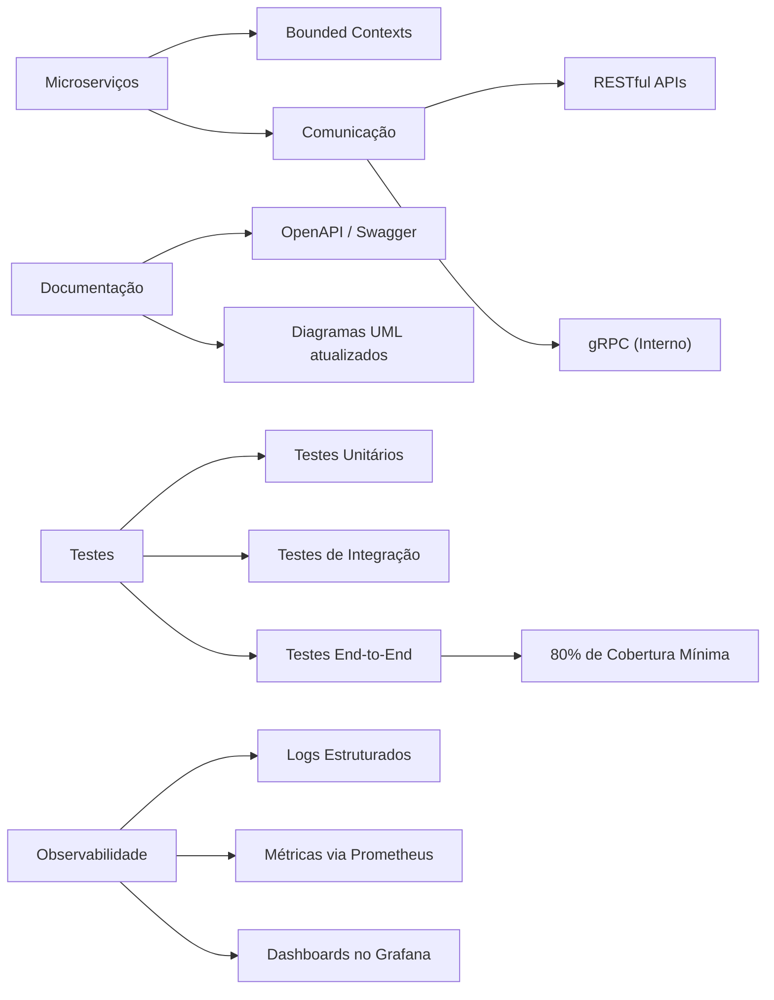

## Projeto: Wine Findings

### Descrição Geral
Wine Findings é uma aplicação multiplataforma que permita aos usuários prever a qualidade de um vinho e receber recomendações de harmonizações baseadas em seus gostos pessoais através de técnicas de mineração de dados que agrupam padrões e criam dashboards interativos a fim de explicar as relações dos dados com suas preferencias palativas, oferecendo assim uma experiência de descoberta e certeza de uma boa escolha, ajudando o usuário a encontrar vinhos que realmente correspondam ao seu perfil.

---

### Dados Utilizados
O sistema usa um modelo de Machine Learning treinado com o dataset "[Portuguese Wines Blog os Vinhos](https://www.kaggle.com/datasets/mariazhokhova/portuguese-wines-blog-os-vinhos)" disponível no [Kaggle](https://www.kaggle.com/).

> [!NOTE]
> Se estamos enganados e o seu tipo de licensa não permite usá-lo ou compartilhá-lo desta maneira, iremos remover o conteúdo caso requisitado.

<!-- É interessante pesquisar permissão e maneiras de coletar mais dados diretamente do site, eles estão mais atualizados e em maior quantidade -->

São quase três mil avaliações de vinhos coletados diretamente do blog "[Os Vinhos](https://osvinhos.blogspot.com/)" de diversos tipos e diversas regiões do mundo.

Algumas colunas possuem conteúdo em português e os valores "-1", "null" ou "-" correspondem a dados não encontrados no blog. O álcool é calculado em porcentagem e os preços dos vinhos em euros. A pontuação da qualidade de cada vinho fica entre 0 e 20. 

---

### Como o Projeto Será Desenvolvido e o que Será Levado em Conta

#### 1. Disponibilidade da Plataforma
- **Web, Mobile e Desktop**  
  - Interface responsiva utilizando frameworks como React, Angular ou Vue, React Native ou Flutter para mobile, Electron ou tecnologia similar para desktop.
  - Permite que o usuário insira dados (ex.: região, produtor, tipos de safra, etc.) e visualize as previsões.

#### 2. Interação do Usuário
- **Definição de Preferências e Exploração dos Dados:**  
  - O usuário pode configurar suas preferências ou selecionar parâmetros específicos para explorar as relações entre os dados.
- **Dashboard Interativo:**  
  - Apresenta insights e visualizações dinâmicas que permitem explorar, por exemplo, como variáveis como o tipo de safra e as descrições avaliativas do gosto influenciam a qualidade do vinho.  
  - A interface educa o usuário, auxiliando na descoberta de perfis que se alinham com seus gostos pessoais.

#### 3. Mineração de Dados
- **Pré-processamento:**  
  - Limpeza dos dados, tratamento de valores ausentes e normalização dos atributos.
- **Análises Exploratórias:**  
  - Identificação das variáveis que mais influenciam a qualidade do vinho.
  - Agrupamento dos vinhos para identificar padrões, clusters e associações entre as variáveis.
- **Recomendações Baseadas em Padrões:**  
  - Sugestão de características valorizadas de acordo com os padrões identificados, permitindo ao usuário conhecer melhor seu perfil.

#### 4. Aprendizagem de Máquina
- **Treinamento do Modelo:**  
  - Desenvolvimento de um modelo de Machine Learning (utilizando técnicas de regressão ou classificação) para prever a qualidade do vinho.
- **Integração de Métodos Supervisionados e Não Supervisionados:**  
  - Utilização de algoritmos supervisionados para predições e técnicas de agrupamento (clustering) para identificar segmentos de vinhos e gerar recomendações personalizadas.
- **Validação do Modelo:**  
  - Aplicação de validação cruzada e uso de métricas como RMSE ou acurácia para assegurar a eficácia do modelo.

#### 5. Armazenamento de Dados
- **Banco de Dados:**  
  - Utilização de um SGBD (como PostgreSQL ou MongoDB) para armazenar registros de consultas, feedback dos usuários e histórico de previsões.
  - Implementação de técnicas de indexação e otimização para garantir desempenho mesmo com grandes volumes de dados.

#### 6. Comunicação do Sistema
- **Comunicação Síncrona:**  
  - Utilização de API REST (HTTP) ou WebSockets para interações diretas, onde o usuário espera respostas imediatas.
- **Comunicação Assíncrona via Mensageria:**  
  - Emprego de mensageria (por exemplo, RabbitMQ, Kafka ou MQTT) para:
    - Processar tarefas pesadas (como treinamento do modelo ou análise de dados) em segundo plano.
    - Enfileirar solicitações de previsão ou de atualização do dashboard, permitindo que os resultados sejam processados e enviados posteriormente à interface.
    - Enviar notificações e atualizações em tempo real (ex.: quando um novo insight ou cluster for identificado), sem depender de requisições HTTP diretas.
    - Registrar eventos e ações do sistema para monitoramento e análise contínua de performance, aumentando a escalabilidade e resiliência do sistema.

#### 7. Disponibilidade Remota
- **Implantação na Nuvem:**  
  - Configuração da aplicação em um ambiente na nuvem (AWS, Azure ou Google Cloud).
  - Garantia de alta disponibilidade por meio de balanceamento de carga e escalabilidade automática.
  - Implementação de políticas de segurança (controle de acesso, criptografia, monitoramento constante) e análises para otimização de custos.

#### 8. Documentação e Gestão do Projeto

- **Testes:**  
  - Implementação de testes unitários e de integração para garantir a robustez da API e das funcionalidades críticas.
- **Documentação:**  
  - Cada linha de código será documentada de forma clara.  
  - Todas as análises e decisões serão registradas com justificativas baseadas em fatos e métricas.
- **Controle de Versão:**  
  - Organização do projeto com Git, utilizando um repositório no GitHub para versionamento, gestão de branches e colaborações.

---

## Requisitos Funcionais e Não Funcionais

### Requisitos Funcionais

1. **Cadastro e Autenticação de Usuário**  
   1.1. O usuário pode criar um perfil com **nome de usuário**, **senha** e **email de recuperação**.  
   1.2. O usuário pode fazer login e logout de forma segura.  
   1.3. O usuário pode redefinir sua senha via email de recuperação.

2. **Formulário de Preferências de Vinhos**  
   2.1. O usuário pode criar e editar um formulário com suas preferências de vinho (ex.: tipo de uva, safra, região, nível de tanino).  
   2.2. Cada opção do formulário possui uma **descrição detalhada** para orientar o usuário.

3. **Dashboard de Recomendações**  
   3.1. Exibição de recomendações dos melhores vinhos para cada usuário, com base nos parâmetros definidos.  
   3.2. Cada recomendação apresenta:  
   - Descrição da preferência e sua relação com o vinho sugerido.  
   - Insights educativos sobre o impacto de cada característica no perfil de sabor.  
   3.3. Geração de resumo do perfil de vinho de cada usuário, destacando os atributos mais valorizados.

4. **Interação Dinâmica**  
   4.1. O usuário pode ajustar parâmetros em tempo real e visualizar a atualização das recomendações instantaneamente.  
   4.2. Feedback do usuário (curtidas, avaliações, comentários) pode ser registrado para refinar futuras sugestões.

5. **Armazenamento e Histórico**  
   5.1. Registro de **consultas**, **feedbacks** e **histórico de previsões** no banco de dados.  
   5.2. Permitir ao usuário revisar seu histórico de recomendações e interações.

6. **Mensageria Assíncrona**  
   6.1. Enfileirar solicitações de previsão e de atualização do dashboard para processamento em segundo plano.  
   6.2. Registrar eventos de sistema (ex.: novo insight identificado) e enviar notificações em tempo real ao frontend.

7. **Administração e Monitoramento**  
   7.1. Interface de administração para visualizar registros de uso e métricas de desempenho.  
   7.2. Logs de auditoria para rastrear ações realizadas pelos usuários e pelo sistema.

### Requisitos Não Funcionais

1. **Usabilidade e Acessibilidade**  
   1.1. Interface responsiva para Web (React, Angular ou Vue), Mobile (React Native ou Flutter) e Desktop (Electron).  
   1.2. Navegação intuitiva e compatível com normas de acessibilidade (WCAG).

2. **Desempenho e Escalabilidade**  
   2.1. Tempo de resposta < 300 ms para operações síncronas (login, carregamento de dashboard).  
   2.2. Processamento assíncrono de modelos de ML garantido por mensageria (RabbitMQ, Kafka ou MQTT).  
   2.3. Balanceamento de carga e escalabilidade automática na nuvem (AWS, Azure ou GCP).

3. **Disponibilidade e Confiabilidade**  
   3.1. SLA mínimo de 99,9% de uptime.  
   3.2. Banco de dados (PostgreSQL ou MongoDB) configurado com réplicas e backups automáticos.

4. **Segurança**  
   4.1. Criptografia de dados em trânsito (TLS) e em repouso.  
   4.2. Controle de acesso baseado em roles e autenticação JWT.  
   4.3. Políticas de senha forte e prevenção contra ataques comuns (XSS, CSRF, SQL Injection).

5. **Manutenibilidade**  
   5.1. Código organizado em módulos/componentes, seguindo boas práticas de Clean Code.  
   5.2. Testes unitários e de integração cobrindo ao menos 80% do código crítico.  
   5.3. Documentação clara de APIs (Swagger/OpenAPI) e do fluxo do projeto.

6. **Gerenciamento de Versão e CI/CD**  
   6.1. Repositório Git no GitHub com branches organizadas (feature, develop, master).  
   6.2. Pipeline de integração e deploy automatizado (GitHub Actions, Jenkins ou similar).

7. **Custo e Otimização**  
   7.1. Monitoramento de custos na nuvem e políticas de desligamento de recursos ociosos.  
   7.2. Uso de instâncias spot ou autoscaling para reduzir custos operacionais.

---

## Arquitetura Geral

### Camadas e Componentes

#### 1. Camada de Apresentação (Grupo FRONT)
- **Web**: Aplicação SPA (Single-Page Application) em HTML, CSS e JavaScript com comunicação via REST e WebSocket.
- **Mobile**: Flutter, compartilhando lógica de negócio mínima com o web.
- **Desktop**: Aplicação Electron, encapsulando o front-end Web.

**Responsabilidades**:
- Interfaces de usuário responsivas e acessíveis.
- Consumo de APIs para autenticação, consultas e streaming de dados.
- Renderização de dashboards, formulários e visualizações gráficas.

#### 2. Camada de API e Orquestração (Grupo BACK)
- **API Gateway**: Ponto único de entrada AWS API Gateway, roteando chamadas para microserviços.
- **Serviço de Autenticação**: Microserviço dedicado a login, JWT, renovação de token e políticas de acesso.
- **Serviço de Usuários e Preferências**: CRUD de perfis, formulários e histórico.
- **Serviço de Recomendações**: Orquestra predições síncronas e encaminha tarefas assíncronas para o motor de ML.
- **Serviço de Monitoramento**: Exposição de métricas via Prometheus e logs estruturados.

#### 3. Camada de Processamento de Dados e ML (Módulos de ML e IA (Clustering, Predição))
- **Microserviço de Pré-processamento**:
  - Limpeza, normalização e enriquecimento de dados antes do treinamento.
- **Motor de Machine Learning**:
  - Modelos de regressão/classificação para predição.
  - Algoritmos de clustering para segmentação de perfis.
- **Validação e Pipeline**:
  - Orquestração de treinamento contínuo (ML Ops) em Airflow ou Kubeflow.

#### 4. Camada de Mensageria (Mensageria (MQ))
- **Broker de Mensagens**: Kafka gerenciando tópicos para:
  1. Pedidos de predição assíncrona.
  2. Atualizações de perfil e feedback.
  3. Eventos de auditoria e notificações.

#### 5. Camada de Persistência (Banco de Dados)
- **PostgreSQL**: Dados relacionais (usuários, preferências, histórico).
- **MongoDB**: Armazenamento de logs, feedbacks semi-estruturados e documentos JSON.
- **Cache**: Redis para caching de resultados frequentes e sessões.

---

### Comunicação e Fluxos

#### 1. Fluxo de Autenticação
1. Cliente envia credenciais ao Serviço de Autenticação.
2. Serviço valida e retorna JWT.
3. Cliente inclui JWT no header `Authorization` em todas as requisições.

#### 2. Fluxo de Recomendação
1. Cliente solicita recomendações ao Serviço de Recomendações.
2. Se for predição simples, serviço chama diretamente o Motor de ML.
3. Para análise pesada, Serviço de Recomendações publica evento no broker.
4. Microserviço de ML consome, processa e persiste resultado.
5. Front-end recebe via WebSocket ou polling e exibe ao usuário.

---

### Implantação e Infraestrutura

- **Containerização**: Docker para todos os serviços.
- **Orquestração**: Kubernetes (EKS/GKE/AKS) com helm charts.
- **CI/CD**: GitHub Actions
  - Build, test e security scan em cada PR.
  - Deploy automático em ambientes de staging e produção.
- **Escalabilidade**:
  - Horizontal autoscaling de pods Kubernetes.
  - Banco gerenciado (RDS/Aurora) com réplicas de leitura.
- **Segurança**:
  - TLS em todas as comunicações.
  - Secrets gerenciados por AWS Secrets Manager.

---

### Padrões e Boas Práticas

- **Design**: Microserviços alinhados a bounded contexts.
- **Comunicação**: RESTful + gRPC para uso interno (alto desempenho).
- **Documentação**: OpenAPI (Swagger) e diagramas UML atualizados.
- **Testes**: Unitários, integração e e2e com cobertura mínima de 80%.
- **Observabilidade**: Logs estruturados, métricas em Prometheus e dashboards no Grafana.
